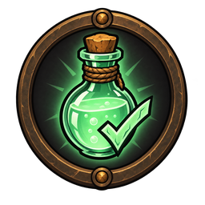
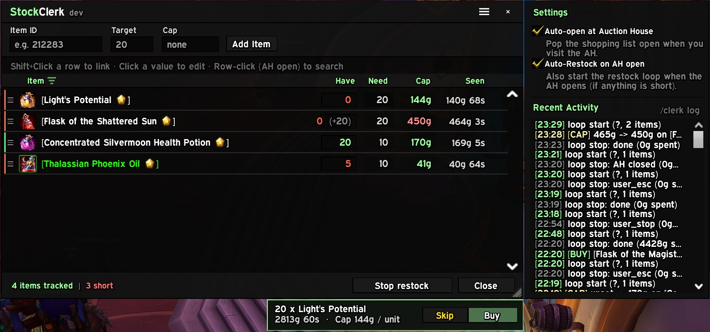
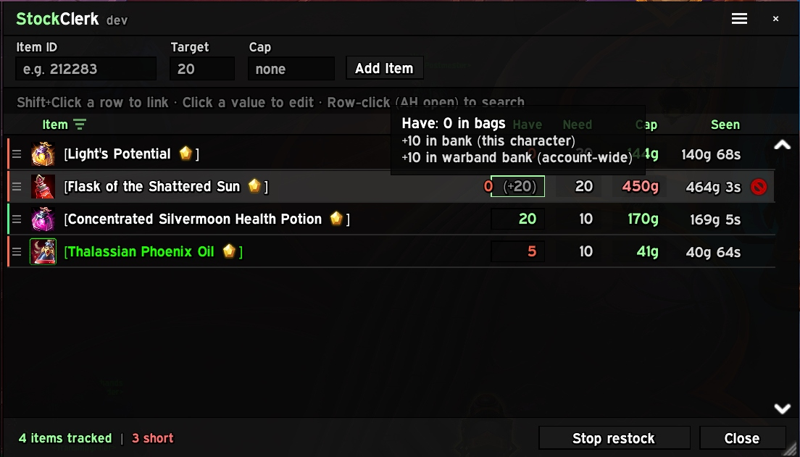

  

<h1 align="center">Stock Clerk</h1>

  <a href="https://www.curseforge.com/wow/addons/stock-clerk">CurseForge</a>
  ·
  <a href="https://github.com/TheWolfIsLoose/StockClerk/releases">GitHub Releases</a>

Keep your consumables stocked. Set a target count for every flask,
potion and reagent you want on hand; Stock Clerk shows what you're short
on and restocks it from your bank or the Auction House.

Retail only (Midnight). No library dependencies.

## Features

- **Per-character shopping list.** Each character has its own items and
  targets. Add items by typing an item ID, by dragging an item from your
  bags onto the Item ID box, or paste a whole list at once with the **+**
  button. **Add common consumables** in the side panel fills a fresh list
  with this expansion's staples.
- **Have / Need / Cap / Last Seen.** Have counts your bags; copies in
  your bank or warband bank show as a dim `(+N)`. Hover it for the
  breakdown.
- **Price caps.** Give any item a max gold per unit and Stock Clerk
  won't buy it above that. Items with no cap buy at the going price;
  the confirm step flags them with an amber "No cap set".
- **Restock from Bank.** At a banker, one click moves exactly what
  you're short from your bank, then your warband bank, into your bags.
  No gold spent, never more than you need.
- **Auction House restock.** At the AH, click a row to search for that
  item, or press **Restock at AH** to walk every short item in list
  order. Each purchase waits for you to press **Buy** (after a short
  countdown) or **Skip**.
- **Stash warning.** If you already own copies in your bank or warband
  bank, the confirm step says so before you spend gold.
- **Mail-aware.** Purchases waiting in your mailbox count toward your
  targets, so nothing gets bought twice.
- **Short-items filter.** The funnel icon hides everything you already
  have enough of.
- **Activity log.** A side panel shows recent purchases, bank pulls and
  cap changes; `/clerk log` opens the full history.
- **Optional automation.** Open the window automatically at the AH or
  the bank, and optionally start an AH restock pass as soon as you
  arrive.

Drag the grip on a row's left edge to reorder; list order is restock
order.

## Screenshots

  
   
  <em>Shopping list with the Skip/Buy confirm step and the settings and
  activity side panel.</em>

  
   
  <em>Hover Have to see where the rest of your stock lives.</em>

## Commands

| Command | What it does |
| --- | --- |
| `/clerk` (or `/sc`, `/stock`) | Open the window |
| `/clerk <item ID or link>` | Add an item with a target of 1 |
| `/clerk log` / `/clerk log clear` | Open or clear the activity log |
| `/clerk pending` / `/clerk pending clear` | Show or reset purchases still in the mail |
| `/clerk dump` | Print your list to chat |
| `/clerk reset` | Clear this character's list |
| `/clerk debug` | Toggle diagnostic chat output |
| `/clerk help` | List commands |

## Installation

Install from [CurseForge](https://www.curseforge.com/wow/addons/stock-clerk)
with the CurseForge app, or download a zip from
[Releases](https://github.com/TheWolfIsLoose/StockClerk/releases) and
unzip it into `Interface/AddOns/`.

## Releasing

Releases are cut by CI from the `## vX.Y.Z` heading in
[CHANGELOG.md](CHANGELOG.md), which holds only the release being cut
(short, player-facing bullets). Detailed notes for every version,
including this one, go in [Dev/HISTORY.md](Dev/HISTORY.md). Planned work lives in [Dev/ROADMAP.md](Dev/ROADMAP.md).

- Push to `dev` with a new `-alphaN` / `-betaN` version heading to
  publish a prerelease (CurseForge Alpha/Beta).
- Merge to `main` with a new stable `vX.Y.Z` heading to publish a release.

The workflow tags the commit, packages it and creates the GitHub
release, which CurseForge picks up. Don't create releases by hand.
Testers can track a branch with `Dev/update.bat` (`update.bat dev` for
alphas). Before pushing, run the smoke test: `lua5.1 Dev/smoke.lua .`

## Credits

- **[atrocityEssentials](https://www.curseforge.com/wow/addons/atrocityessentials)**
  and **[NorskenUI](https://github.com/Nrsken/NorskenUI)** inspired the
  flat, dark look.
- **[plusmouse](https://github.com/plusmouse)**'s addons set the bar:
  [Auctionator](https://www.curseforge.com/wow/addons/auctionator) for
  the list pattern and a well-behaved AH addon,
  [Baganator](https://www.curseforge.com/wow/addons/baganator) and
  [Syndicator](https://www.curseforge.com/wow/addons/syndicator) for
  counting items across every storage location. No code is copied.

Built with heavy AI assistance; every change was reviewed and tested
in-game before release.

## License

MIT. See [LICENSE](LICENSE).
