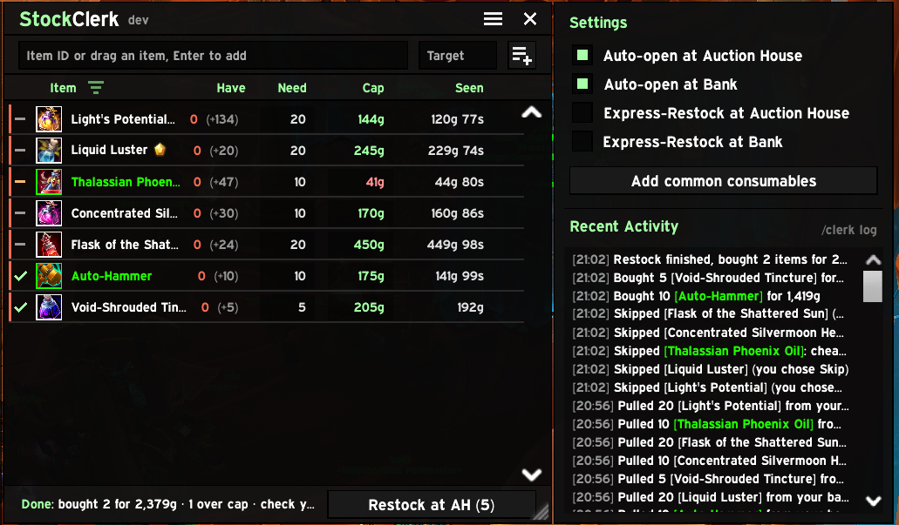
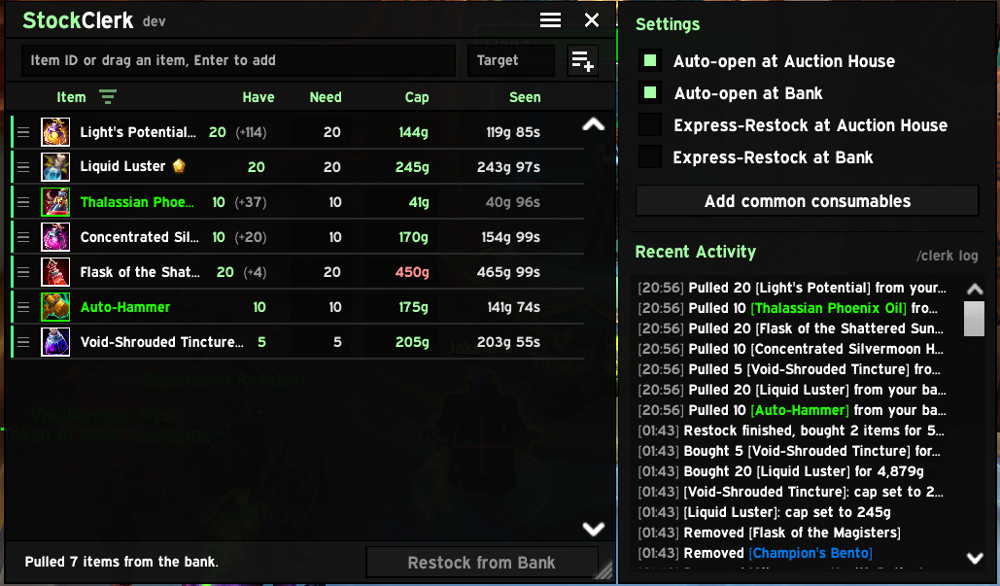
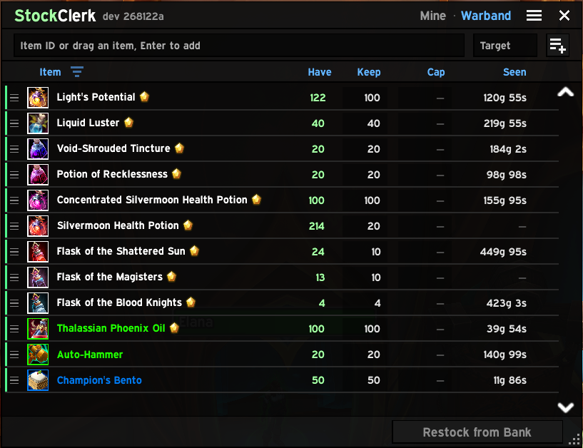

  

<h1 align="center">Stock Clerk</h1>

  A pocket-sized shopping list for your consumables. 
  <a href="https://www.curseforge.com/wow/addons/stock-clerk">CurseForge</a>
  ·
  <a href="https://github.com/TheWolfIsLoose/StockClerk/releases">Releases</a>

Set how many of each flask, potion and food you want on hand. Stock Clerk
shows what you're short on and restocks it from your bank or the Auction
House in a few clicks, so a trip between dungeons stays a quick one. Keep a
shared stock in your warband bank too, and every character restocks from it.

  

## Features

- **A list per character.** Add items by ID, by dragging them from your
  bags, or in bulk. One click adds this expansion's common consumables.
- **A warband list.** Keep at least a set number of anything in your
  warband bank for all your characters. After your own shopping, Stock
  Clerk offers to top it up, with its own price caps.
- **Deposit at the bank.** Anything above your own targets goes into the
  warband bank, where every character can restock from it. Always a
  button, never automatic.
- **Restock from Bank.** At the bank, one click moves exactly what you're
  short from your bank and warband bank into your bags.
- **Checkout at the Auction House.** Restock goes down your list and
  **Buy** appears right where you clicked, so it's one click per item and
  rows tick off as you go. Nothing is ever bought without your click.
- **Price caps.** Set a max per unit and Stock Clerk won't pay more. It
  also asks for a second look before you buy something you already have in
  the bank, have no cap on, or that costs well above what you last saw.
- **Never buys twice.** Purchases still in your mail, and warband buys
  your other characters haven't deposited yet, count toward your targets.
- **A receipt for everything.** Purchases, bank pulls and deposits show in Recent
  Activity; `/clerk log` has the full history.
- **Hands-free if you like.** Open automatically at the AH or bank, and
  start restocking as soon as you arrive.

  

  

## Commands

| Command | What it does |
| --- | --- |
| `/clerk` (or `/sc`, `/stock`) | Open the window |
| `/clerk <item ID or link>` | Add an item with a target of 1 |
| `/clerk log` | Open the activity log (paste it into a bug report) |
| `/clerk debug` | Record extra detail in the log until you `/reload` |
| `/clerk reset` | Clear this character's list |
| `/clerk help` | List commands |

## Install

Retail (Midnight) only. No other addons required.

Install from [CurseForge](https://www.curseforge.com/wow/addons/stock-clerk),
or unzip a [release](https://github.com/TheWolfIsLoose/StockClerk/releases)
into `Interface/AddOns/`. Found a bug? Open an
[issue](https://github.com/TheWolfIsLoose/StockClerk/issues) with your
`/clerk log`.

## Credits

The flat, dark look comes from
[atrocityEssentials](https://www.curseforge.com/wow/addons/atrocityessentials)
and [NorskenUI](https://github.com/Nrsken/NorskenUI).
[plusmouse](https://github.com/plusmouse)'s
[Auctionator](https://www.curseforge.com/wow/addons/auctionator),
[Baganator](https://www.curseforge.com/wow/addons/baganator) and
[Syndicator](https://www.curseforge.com/wow/addons/syndicator) set the bar
for a well-behaved AH addon and for counting items everywhere they live. No
code is copied.

Built with heavy AI assistance; every change is reviewed and tested in-game
before release. Developers: see [Dev/](Dev/) for the roadmap, history and
release process.

## License

MIT. See [LICENSE](LICENSE).
